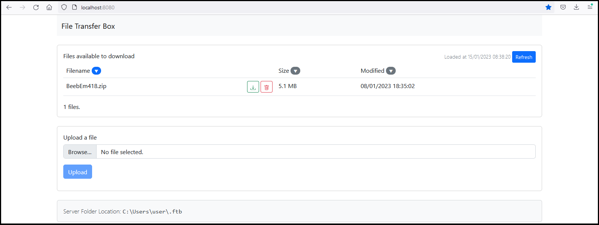

# File Transfer Box 3

File Transfer Box 3 is a rewrite of File Transfer Box using

- A Typescript / React frontend using Axios and Bootstrap.
- A Kotlin / Spring backend.

It is a utility to allow the upload and download of files.

It is intended for use where other means of copying a file are unavailable. 

It does not support:

- Sessions (i.e. login/logout).
- Encryption during transfer.



## Build pre-requisites

These software installs are required:

- Node 16 or above.
- Java SDK 8 or above.

## Build instructions

Build the client first

```bash
cd ftb-client
npm run build
```

The output will be written to `ftb-server/src/main/resources/static` and hence included in the server build.

Build the server second

```bash
cd ftb-server
./gradlew build
```

The output will be found as `ftb-server/build/libs/ftb-3.0.0.jar` and can be run using:

```bash
java -jar ftb-server/build/libs/ftb-3.0.0.jar
```

The browser based GUI can then be reached on port 8080.
